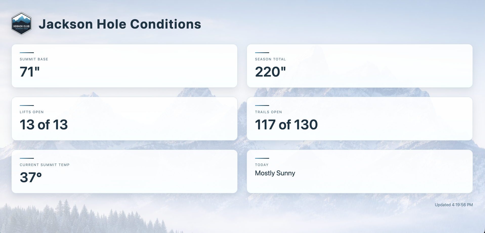

# Jackson Hole Mountain Conditions Display



A standalone, live-updating digital signage dashboard designed to display real-time mountain conditions for Jackson Hole.  
Built for large-format displays in lodges, clubhouses, and public spaces, with a clean alpine aesthetic inspired by Hoback Club.

---

## Overview

This project is a lightweight web application that continuously pulls live mountain data from Jackson Hole’s public XML feed and presents it in a visually refined, easy-to-read dashboard.

The display is designed to:
- Be readable from across a room
- Feel calm, alpine, and premium
- Run unattended on a dedicated machine
- Update automatically without page reloads

It is intentionally **decoupled** from any main website and runs as its own small web server.

---

## Features

- **Live mountain data**
  - Summit base depth
  - Season total snowfall
  - Lifts and trails open
  - Current summit temperature
  - Daily weather summary

- **Automatic refresh**
  - Backend polls the XML feed every 60 seconds
  - Frontend updates every 30 seconds

- **Digital signage–ready design**
  - High contrast typography
  - Glass-style panels for readability
  - Subtle alpine background imagery
  - Optimized for TVs and wall-mounted displays

- **No external frontend dependencies**
  - Plain HTML, CSS, and JavaScript
  - Simple Node.js backend

---

## Tech Stack

- **Node.js**
- **Express**
- **fast-xml-parser**
- **Vanilla HTML / CSS / JavaScript**

No frameworks, no build step, no client-side libraries.

---

## Project Structure

```text
Jackson-Hole-Weather-Feed/
├── server.js
├── package.json
├── public/
│   ├── index.html
│   └── assets/
│       ├── hoback-club-logo.png
│       └── mountains-bg.png
└── docs/
    └── dashboard-screenshot.png
